# bellabeat-case-study

Data analysis case study for Bellabeat wellness technology company - Google Analytics Certificate capstone project 
(image from https://bellabeat.com/)

## ASK

### **Business Task**

Bellabeat, a high-tech company that manufactures health-focused smart products for women, wants to better understand how consumers are using smart devices to monitor their daily health and fitness habits. By analyzing smart device usage data from FitBit users, the goal is to uncover behavioral trends and generate insights that can guide Bellabeat’s future marketing strategy.

The key business question is:

**“How can Bellabeat use smart device data to gain insight into how consumers are using their smart devices and apply these insights to influence their marketing strategy?”**

---

### **Guiding Questions**

1. **What are some trends in smart device usage?**
   – Patterns in steps, calories, sleep, and activity intensities.

2. **How could these trends apply to Bellabeat customers?**
   – Inferring user behavior to improve user engagement.

3. **How could these trends help influence Bellabeat's marketing strategy?**
   – Identifying key times and behaviors to target with product messaging and app features.

---

### **Key Stakeholders**

* **Urška Sršen**, Bellabeat’s co-founder and Chief Creative Officer.
* **Bellabeat Marketing Team**, responsible for creating data-driven campaigns.
* **Bellabeat Product & App Teams**, who can use insights to improve features, notifications, and user experience.

---

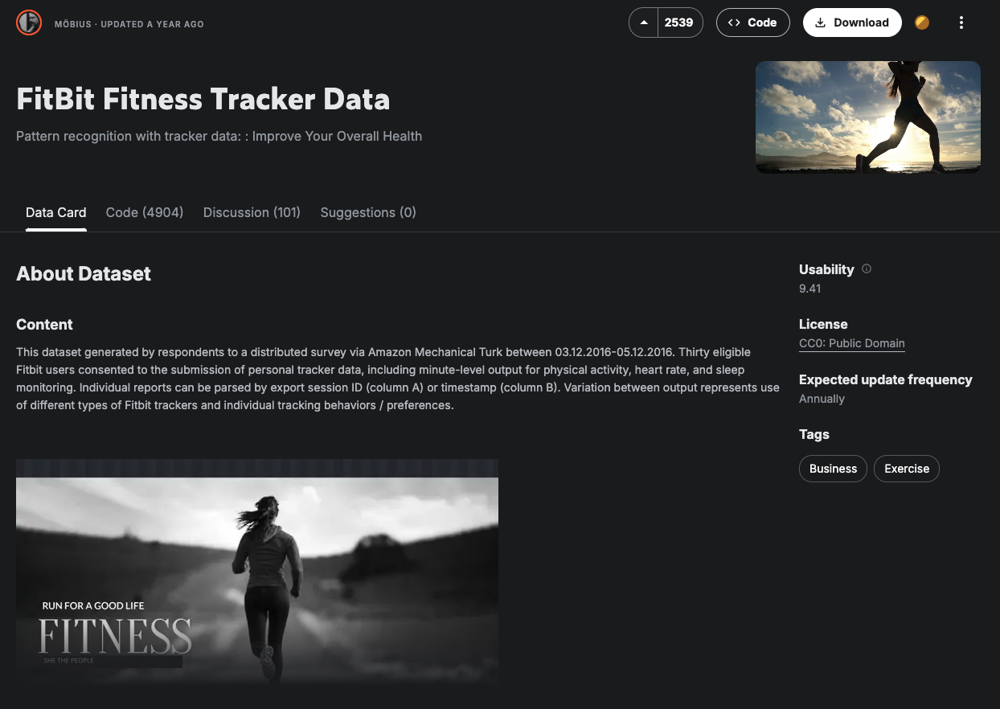
Image from https://www.kaggle.com/datasets/arashnic/fitbit
## PREPARE

### **Data Source Description**

For this case study, I used public Fitbit fitness tracker data made available through [Mobius](https://www.kaggle.com/datasets/arashnic/fitbit) on Kaggle. The dataset was originally generated by **30 Fitbit users** who consented to the release of their anonymized personal tracker data. The dataset spans the period from **March 12, 2016, to May 12, 2016** and includes daily, hourly, and minute-level activity logs for each user.

---

### **Data Storage**

The data was downloaded as 18 individual CSV files. 11 files were stored in Google Drive and loaded in Google Colab for cleaning, exploration, and analysis. These files were then loaded into Pandas dataframes for manipulation and visualization.

---

### **Data Organization**

Each file represents different dimensions of user activity, such as steps, sleep, calories burned, and heart rate, and is organized either by **day**, **hour**, or **minute** depending on the granularity.

---

### **Data Credibility and ROCCC**

The dataset reasonably meets the **ROCCC** standards:

* **Reliable**: Data is sourced directly from Fitbit devices.
* **Original**: Provided by Mobius through Kaggle, with consent from participants.
* **Comprehensive**: Covers various metrics including activity, sleep, and weight.
* **Current**: Though the data is from 2016, it still reflects general usage patterns of wearable tech relevant to Bellabeat's business goals.
* **Cited**: The source is clearly stated and traceable through Kaggle.

---

### **Bias and Limitations**

* The dataset only includes **30 users**, which limits generalizability.
* The gender, age, and health backgrounds of the users are unknown.
* All users are from a specific time frame and may not represent seasonal trends.
* Potential **self-selection bias**: users who volunteered their data may be more health-conscious.

Despite these issues, the dataset is sufficient for **trend analysis and behavioral insights**, which is the focus of this case study.

---

### **Privacy, Licensing, and Security**

* The dataset is publicly available under **Kaggle’s open data license**.
* User identities are anonymized.
* No personally identifiable information (PII) is included.

---

### **Data Integrity and Suitability**

* The data was examined for missing values, duplicates, and formatting inconsistencies.
* Minor cleaning steps such as datetime parsing, column renaming, and null filtering were applied.
* Overall, the data is structured and clean enough to generate meaningful insights related to user activity, sleep, and calorie trends.

---

## Process

### Guiding Questions

#### What tools are you choosing and why?

I used **Google Colab** as my main analysis environment because it is cloud-based, allows Python coding with built-in support for libraries like **Pandas**, **Matplotlib**, **Seaborn**, and **Plotly**, and it integrates well with Google Drive. These tools are well-suited for handling large CSV files, performing data wrangling, and visualizing trends interactively.

---

#### Have you ensured your data’s integrity?

Yes. I ensured data integrity by:

* Verifying the data structure using `.info()` and `.head()` commands.
* Checking for missing values using `.isnull().sum()`.
* Confirming consistency of timestamps and data types across datasets.
* Removing duplicate entries where necessary.

---

#### What steps have you taken to ensure your data is clean?

For each of the 11 datasets, the following cleaning steps were taken:

* Removed unnecessary columns like unnamed indices.
* Converted all time-related columns to consistent `datetime` format.
* Checked for and removed duplicate rows.
* Verified data types and corrected them where necessary (e.g., converting dates, integers, and floats).
* Identified missing values, especially in `weight_log_info.csv` (e.g., fat column) and excluded them from certain plots.
* Renamed columns or files when needed for clarity (e.g., removing “merged” from filenames).

---

#### How can you verify that your data is clean and ready to analyze?

The following checks confirm readiness:

* Used `.describe()` and `.info()` to confirm column data types and check for outliers or anomalies.
* Ensured timestamps matched logical ranges (e.g., no future dates).
* Confirmed row counts match expected entries (e.g., 24 hourly entries per day).
* Cross-checked related datasets (e.g., steps per hour vs. daily steps).

---

#### Have you documented your cleaning process?

Yes. All cleaning and transformation steps were documented within the Google Colab notebook using code comments and markdown cells. These records show which functions were used, the rationale behind cleaning choices, and any assumptions made during the process.

---

### Key Tasks

| Task                    | Description                                                                                                            |
| ----------------------- | ---------------------------------------------------------------------------------------------------------------------- |
| **1. Check for errors** | Used `.isnull()`, `.duplicated()`, `.info()`, and `.describe()` to find missing, duplicate, or malformed data.         |
| **2. Choose tools**     | Selected Google Colab, Pandas, Seaborn, Plotly for cleaning, transformation, and visualization.                        |
| **3. Transform data**   | Parsed datetime formats, extracted day/hour/minute for time series plots, grouped data to analyze daily/weekly trends. |
| **4. Document process** | All steps are recorded in the Colab notebook with clear markdown headers and in-line comments.                         |

---

### Deliverable: Cleaning & Transformation Summary

**Datasets used**:

* daily\_activity.csv
* heartrate\_seconds.csv
* hourly\_calories.csv
* hourly\_intensities.csv
* hourly\_steps.csv
* minute\_calories\_narrow\.csv
* minute\_intensities\_narrow\.csv
* minute\_METs\_narrow\.csv
* minute\_sleep.csv
* minute\_steps\_narrow\.csv
* weight\_log\_info.csv

**Cleaning actions performed**:

* Converted date/time fields to datetime objects
* Removed duplicate rows
* Dropped unnecessary or empty columns
* Excluded missing values in non-critical columns
* Split datetime fields into components when needed for plots
* Grouped/aggregated for analysis without altering original records

---

## Analyze

### Summary of Analysis

Using Fitbit user data, we analyzed trends in daily activity, heart rate, calories, sleep, steps, and weight metrics to uncover insights that could inform Bellabeat’s strategy. The data was aggregated, cleaned, and explored through multiple visualizations. Below are the key findings:

---

### Visual Data Analysis and Key Findings

1. **Heart Rate by Hour**  
   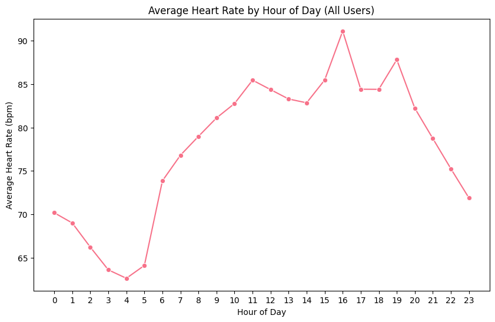  
   Heart rate was generally higher in the **morning and evening**, peaking around **7–9 AM** and **5–7 PM**, indicating activity spikes during commute and workout times.  

2. **Manual vs Automatic Weight Reports**  
   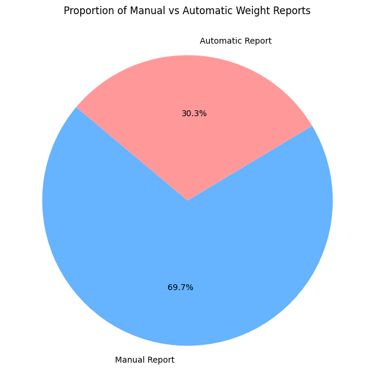  
   **Only 1 out of 8 users** manually logged their weight. Most relied on automatic syncing, suggesting a preference for passive tracking.  

3. **Correlation Heatmap – Daily Activity**  
  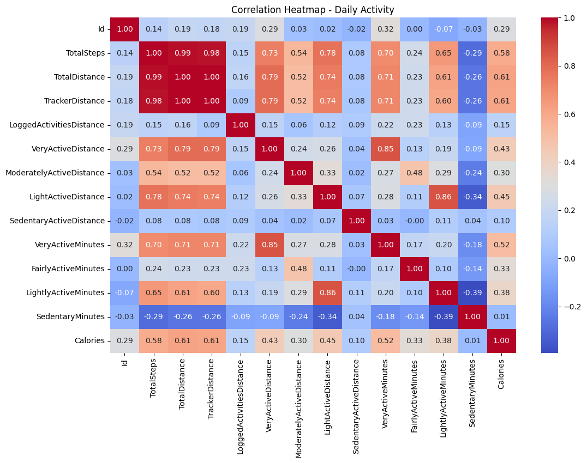  
   Strong positive correlations were found between:  

   * **Total Steps and Calories (0.95)**  
   * **Very Active Minutes and Total Steps (0.87)**  
     These indicate that more active minutes are closely tied to total energy expenditure.  

3. **Calories Over Time**  
  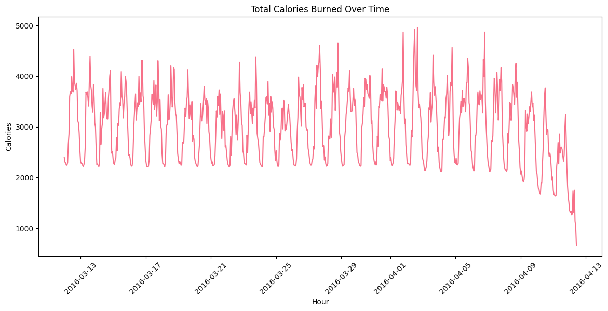  
   Caloric expenditure increases during the day and drops off late at night, aligning with typical waking and sleeping patterns.  

4. **Heart Rate Boxplot – Day of Week**  
   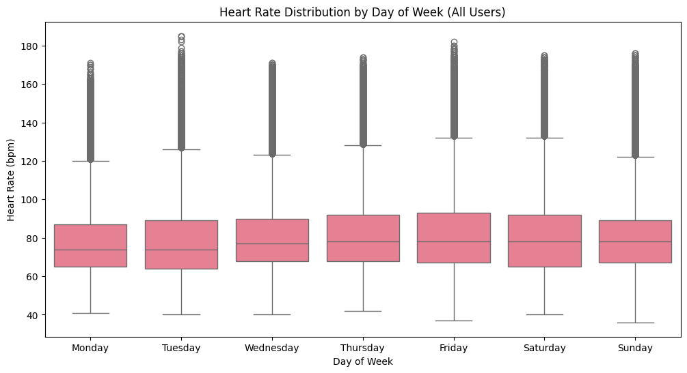  
   Highest heart rates were recorded on **Tuesdays and Fridays**, suggesting more intense activity or stress on these days.  

5. **Heart Rate Distribution**  
   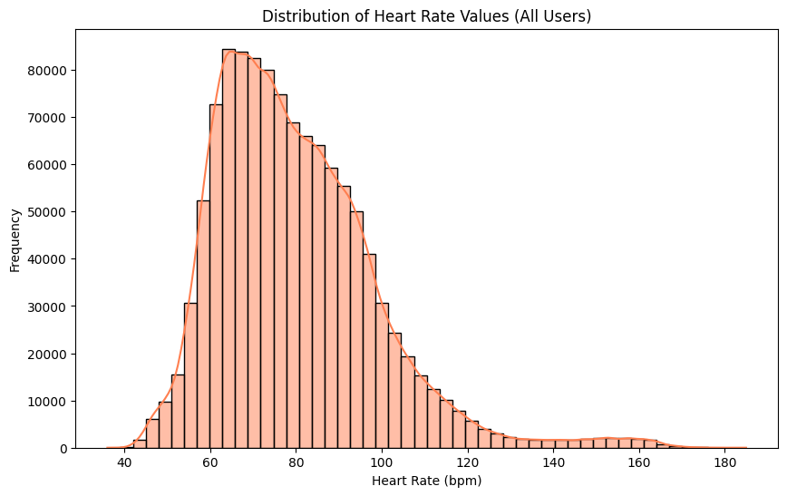  
   Most heart rate values clustered between **60 and 110 BPM**, with a median around **75 BPM**, indicating the resting or mildly active state of most users.  

6. **Calories Burned by Hour**  
   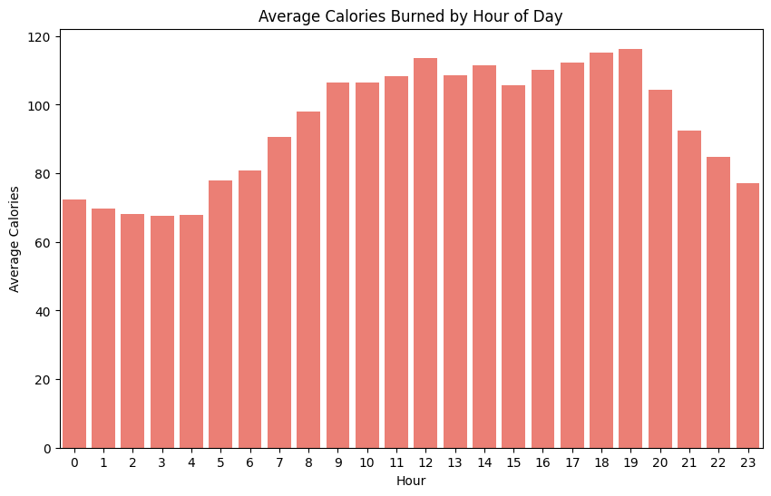  
   Users burned the most calories between **6–8 AM** and **5–7 PM**, consistent with common exercise windows.  

7. **Average Active Minutes by Day of Week**  
   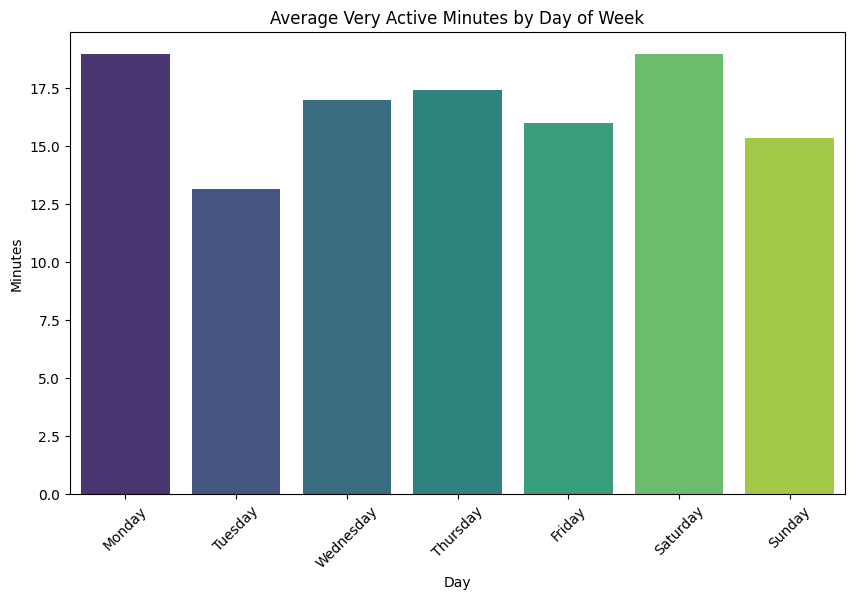  
   Activity levels peaked on **Tuesdays, Thursdays, and Saturdays**, suggesting preferred workout days.  

8. **Calories Burned Over Time with Confidence Interval**  
    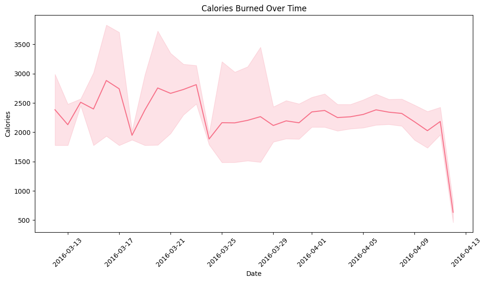  
    There is an **overall increase in calories burned over time**, though variability grows later in the week, showing inconsistent effort.  

9. **Distribution of Total Steps**  
    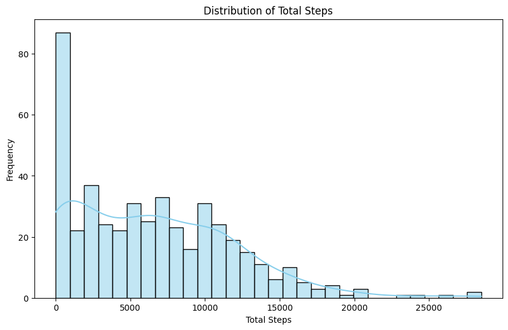  
    Most users logged **fewer than 10,000 steps per session**, suggesting room for improvement in daily movement.  

10. **Proportion of Activity Minutes**  
  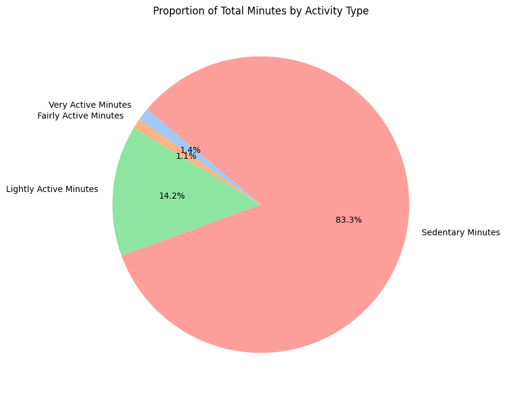  
* **Sedentary**: \~70%  
* **Lightly Active**: \~20%  
* **Moderately Active**: \~7%  
* **Very Active**: \~3%  
  Users spend the majority of their time being sedentary.  

11. **Total Steps by Day of Week**  
    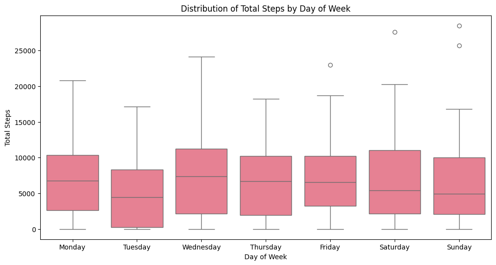  
    Highest step counts were recorded on **Wednesdays and Saturdays**, indicating midweek and weekend activity boosts.  

12. **Steps vs Calories**  
    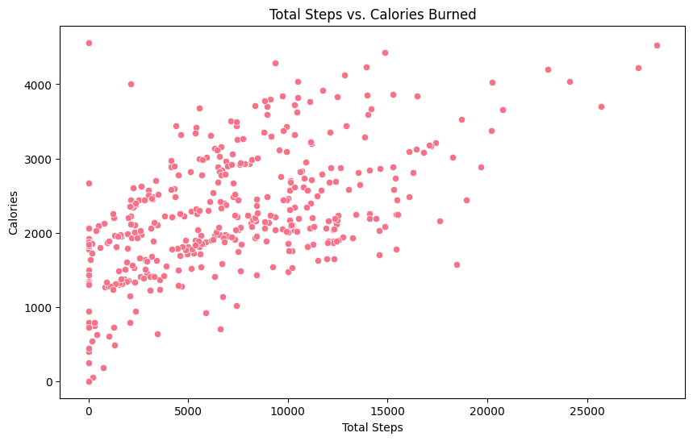  
    A strong linear relationship was observed: **more steps directly translated to more calories burned**.  

---

### Insights for Bellabeat

* **Activity engagement is low** overall, with most time spent in sedentary or light activity zones.
* **Caloric and step data show strong patterns**, making them reliable targets for goal-setting features.
* Users prefer **automated tracking**; Bellabeat devices should emphasize seamless syncing.
* **Engagement peaks on certain days and times**, suggesting that Bellabeat can tailor notifications or challenges for **Tuesdays, Thursdays, and Saturdays** during **morning/evening hours**.
* Customizable reminders and health nudges can help increase consistency.

---

